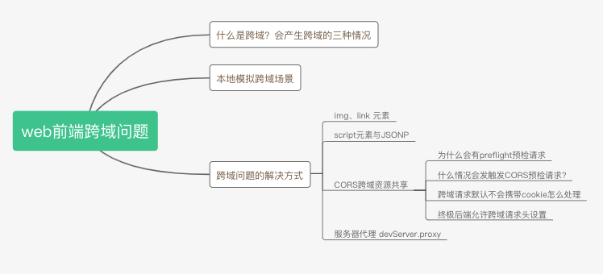
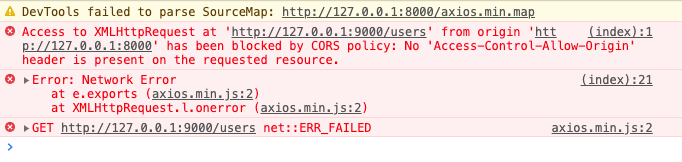
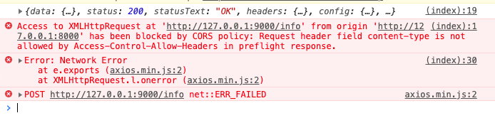
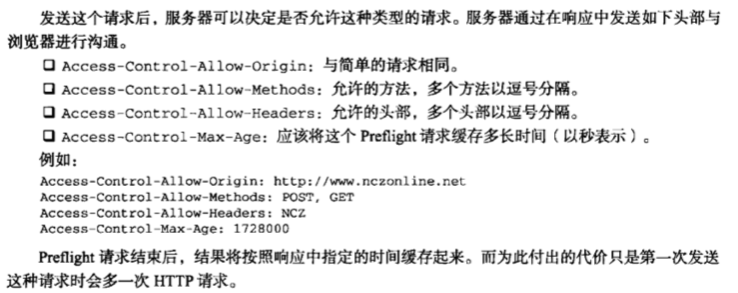

# 利用koa来彻底理解web前端跨域问题
JS高程3中在Ajax那一章里有详细的讲解跨域的问题，由于是纯理论，之前看时只是了解个大概。之后学会了koa后，用koa来写测试接口模拟跨域的场景，对跨域问题有了更深层次的理解，下面来对跨域的相关知识点进行整理、回顾，并写demo做一些测试



## 什么是跨域？会产生跨域的三种情况
跨域是浏览器同源策略引起的接口调用问题，**只针对XMLHttpRequest发出的请求**。

**协议、端口、host 三者有一个不同就会跨域**，导致ajax请求接口失败

以 http://127.0.0.1:9000 为例
- `http` 为协议，还可以是 `https`
- `127.0.0.1` 为 host，还可以是 baidu.com、api.xx.com等
- `9000` 为端口，在不指定端口的情况下，默认http为80端口，https为443端口

## 本地模拟跨域场景
我们本地一般最简单的方式就是通过不同的端口来模拟出跨域的场景，现在我们用koa在本地创建两个服务，一个是在8000端口的静态文件服务，一个是在9000端口的接口服务

静态文件服务
```js
// 8000_static_server.js
const Koa = require('koa')
const app = new Koa()

app.use(require('koa-static')(__dirname + '/public')) // 静态服务

app.listen(8000, () => console.log('服务已开启，端口 8000'))
```
我们访问 http://127.0.0.1:8000 就可以访问public/index.html到这个页面，这个页面再请求 9000端口的接口，就算跨域了。
```html
<button id="send-get-request">发送get请求</button>
<button id="send-post-request">发送post请求</button>
<script src="axios.min.js"></script>
<script>
  let sendGetRequest = document.getElementById('send-get-request')
  let sendPostRequest = document.getElementById('send-post-request')
  sendGetRequest.onclick = async () => {
    try {
      let res = await axios.get('http://127.0.0.1:9000/users')
      console.log(res)
    } catch(e) {
      console.error(e)
    }
  }
  sendPostRequest.onclick = async () => {
    try {
      let payload = { x: 1, y: 1}
      let res = await axios.post('http://127.0.0.1:9000/info', payload)
      console.log(res)
    } catch(e) {
      console.error(e)
    }
  }
</script>
```

接口服务
```js
// 9000_api_server.js
const Koa = require('koa')
const Router = require('koa-router')
const app = new Koa()
const router = new Router()

// 路由
router.get('/users', ctx => ctx.body = 'users')
router.post('/info', ctx => ctx.body = { b: 1 })

app.use(router.routes()).use(router.allowedMethods())

app.listen(9000, () => console.log('服务已开启，端口 9000'))
```
点击发送get请求，chrome会报跨域限制的错误，请求失败



```js
Access to XMLHttpRequest at 'http://127.0.0.1:9000/users' from origin 'http://127.0.0.1:8000' has been blocked by CORS policy: No 'Access-Control-Allow-Origin' header is present on the requested resource.
```

## 跨域问题的解决方式
### img、link 元素
img和link元素都会给服务器发送get请求，因为这个并不属于ajax请求，所以浏览器不会阻止请求发送到服务端。我们可以利用这个特性来发送跨域请求，下面来看例子
```html
<button id="send-get-img">使用img发送get请求</button>
<button id="send-get-link">利用link发送get请求</button>
<script src="axios.min.js"></script>
<script>
  let sendGetRequestByImg = document.getElementById('send-get-img')
  let sendGetRequestByLink = document.getElementById('send-get-link')
  sendGetRequestByImg.onclick = async () => {
    let img = document.createElement('img')
    img.src = 'http://127.0.0.1:9000/users'
    img.style.display = 'none'
    document.body.appendChild(img)
    setTimeout(() => {
      document.body.removeChild(img)
    }, 2000)
  }
  sendGetRequestByLink.onclick = async () => {
    let link = document.createElement('link')
    link.href = 'http://127.0.0.1:9000/users'
    link.rel = 'stylesheet'
    document.head.appendChild(link)
    setTimeout(() => {
      document.head.removeChild(link)
    }, 2000)
  }
</script>
```
img和link标签虽然都可以发送跨域的get请求，img常用于跟踪用户点击页面或动态广告曝光的次数。这种跨域方式都无法接收服务器响应的数据，请求是单向的。

### script元素与JSONP
上面利用link元素与img元素，做get请求，那script理论上也是可以发送跨域get请求的，而且script元素还可以利用JSONP，接收后台的响应

JSONP是JSON with padding(填充式JSON或参数式JSON)的简写，他由两部分组成:
1. 回调函数
2. 数据

```js
callback({"user": "zhangsan"})
```
当script元素接收到后端响应的JSONP数据时，会调用页面中对应的callback函数，而callback函数名字一般是通过前端请求url的查询参数来决定的，来看看看下面的例子
```html
<button id="send-get-script">使用script发送get请求</button>
<script>
  let sendGetRequestByScript = document.getElementById('send-get-script')
  sendGetRequestByScript.onclick = async () => {
    let script = document.createElement('script');
    script.type="text/javascript" 
    // script.src = "http://127.0.0.1:9000/users"
    script.src = "http://127.0.0.1:9000/jsonpTest?callback=handleRes"
    document.body.appendChild(script)
    setTimeout(() => {
      document.body.removeChild(script)
    }, 2000)
  }
  // 这里可以接收到对应的数据
  function handleRes(response) {
    console.log('利用jsonp接收到的响应数据', response)
  }
</script>
```
JSONP需要后端返回JSONP格式的数据，前端才能接收到响应，来看看node是怎么处理的
```js
router.get('/jsonpTest', ctx => {
  console.log(`接收到get请求${ctx.url}`)
  let resdata = {
    user: 'zhangsan'
  }
  let jsonpData = `${ctx.query.callback}(${JSON.stringify(resdata)})`
  console.log('ctx.query.callback', ctx.query.callback)
  console.log('jsonpData', jsonpData) // handleRes({"user":"zhangsan"})
  ctx.body = jsonpData
})
```
JSONP的缺点：
1. 不安全，后端返回的数据可以决定前端要执行的函数
2. 不容易确定JSONP请求是否失败

### CORS跨域资源共享
一般限制跨域请求这种安全策略可以预防某些恶意行为，但实现合理的跨域请求对开发web应用也是至关重要的，因此W3C提出了 CORS（Cross-Origin Resource Sharing, 跨域资源共享）的解决方案，**CORS 定义了浏览器与服务器应该如何沟通，背后的基本思想是，使用自定义的HTTP头部让浏览器与服务器沟通，从而决定请求或响应是否成功**

比如，前端在发送请求时，浏览器会自动附加一个额外的请求头 Origin，包含请求页面的源信息(协议、域名、端口)，下面是Origin头部的一个示例
```js
Origin: http://127.0.0.1:8000
```
如果服务器认为可以接受该请求，可以在响应头 Access-Control-Allow-Origin 中发相同的源信息（或者 *），例如
```
Access-Control-Allow-Origin：http://127.0.0.1:8000
```
**如果没有这个头部浏览器会驳回请求。也就是说，浏览器其实发送了请求，后端也接收到了请求，只是浏览器阻止了响应，并报错了，这一点很关键。**

后端只要加一个响应头就可以解决跨域的问题，我们来试试，通过写一个中间件来允许跨域请求
```js
// allowCors.js
async function allowCORS(ctx, next) {
  console.log(ctx.headers['origin'])
  ctx.set({
    'Access-Control-Allow-Origin': 'http://127.0.0.1:8000'
    // 'Access-Control-Allow-Origin': ctx.headers['origin']
    // 'Access-Control-Allow-Origin': '*'
  })
  next()
}

module.exports = allowCORS
```
在路由前面加一行，引入该中间件即可
```js
app.use(require('./allowCors'))
```
我们再来测试下发送请求，get请求可以了，没有提示跨域了，但post请求却还是提示跨域，这是为什么呢？这就涉及preflight，预检请求的概念了



```js
Access to XMLHttpRequest at 'http://127.0.0.1:9000/info' from origin 'http://127.0.0.1:8000' has been blocked by CORS policy: Request header field content-type is not allowed by Access-Control-Allow-Headers in preflight response.
```
#### 为什么会有preflight预检请求
浏览器限制跨域有两种方式：
1. 浏览器限制发起跨域请求
2. 跨域请求可以正常发起，但返回的结果被浏览器拦截了

一般浏览器都是使用第二种方式限制跨域请求，**跨域请求已经到达服务器，并可能对数据库里的数据进行了操作，但返回的结果被浏览器拦截了，对前端来讲这是一次失败的请求，但可能对数据库里的数据产生了影响**

为了防止这种情况发生，**对于可能对服务器数据产生副作用的HTTP请求方法，浏览器会先使用OPTIONS方法发起一个预检请求**，从而获知服务器是否允许跨域请求：如果允许，就发送带真实的数据请求，如果不允许，则阻止带数据的真实请求。

#### 什么情况会发触发CORS预检请求?
- 使用了PUT、DELETE、CONNECT、OPTIONS、TRACE、PATCH请求方法
- 人为设置了CORS安全的请求头之外的其他请求头，下面是安全的请求头列表
  - Accept 
  - Accept-Language
  - Content-Language
  - Content-Type
  - DPR
  - Downlink
  - Save-Data
  - Viewport-Width
  - Width
  - Content-Type值为 application/x-www-form-urlencoded、multipart/form-data、text/plain

现在知道刚才的POST请求为什么出错了吧，请求头里面Content-type为application/json，不是安全的请求头，需要加上一个请求头设置即可
```js
'Access-Control-Allow-Headers': 'Content-Type' // 或 *
```
同理，当我们使用 put请求时，需要加上
```js
'Access-Control-Allow-Methods': 'PUT' // 或 *，注意PUT要大写
```



#### 跨域请求默认不会携带cookie怎么处理
axios 跨域请求 默认不发送cookie，如果想发送的请求携带cookie需要将withCredentials设置为true
```js
// `withCredentials` indicates whether or not cross-site Access-Control requests
// should be made using credentials
// withCredentials: false, // default
axios.defaults.withCredentials = true // 允许跨域请求发送cookie

// OPTIONS需要加一个设置
'Access-Control-Allow-Credentials': 'true'
```

#### 终极后端允许跨域请求头设置 
因此终极的后端允许跨域的请求头设置为
```js
ctx.set({
  'Access-Control-Allow-Origin': '*',
  'Access-Control-Allow-Headers': '*',
  'Access-Control-Allow-Methods': '*',
  'Access-Control-Allow-Credentials': 'true', // 允许携带cookie
  'Access-Control-Max-Age': 3600 // 对于相同的请求，仅在第一次发送options预检请求，之后1小时内不需要预检请求
})
```

### 服务器代理 devServer.proxy
还有一种跨域方式就是通过服务器代理的方式来进行跨域请求。就是请求同源服务器，通过该服务器转发请求到目标服务器，得到结果再转发给前端。

```js
// http-proxy-middleware
const express = require('express');
const { createProxyMiddleware } = require('http-proxy-middleware');
 
const app = express();
app.use(express.static(__dirname + '/public'))

app.use('/users', createProxyMiddleware({ 
    target: 'http://127.0.0.1:9000', changeOrigin: true 
  })
);
app.use('/info', createProxyMiddleware({ 
    target: 'http://127.0.0.1:9000', changeOrigin: true 
  })
);
app.listen(7000);
```
有没有很熟悉？其实我们在vue.config.js里面配置devServer的proxy属性就是调用类似的方法

## 参考
更多细节可以参考下面的文档

- [Ajax - Web 开发者指南 | MDN](https://developer.mozilla.org/zh-CN/docs/Web/Guide/AJAX)
- [XMLHttpRequest - Web APIs | MDN](https://developer.mozilla.org/en-US/docs/Web/API/XMLHttpRequest)
- [跨來源資源共用（CORS） - HTTP | MDN](https://developer.mozilla.org/zh-CN/docs/Web/HTTP/Access_control_CORS)
- [前端 | 浅谈preflight request - 简书](https://www.jianshu.com/p/b55086cbd9af)
- [前端跨域问题 - 网络编程 | Node笔记](https://www.yuque.com/guoqzuo/rdrqd5/pwlw7i#f5457f4a)
- [跨域资源共享 | JS高程3笔记](https://www.yuque.com/guoqzuo/js_es6/fcw53h#ac35dda4)
