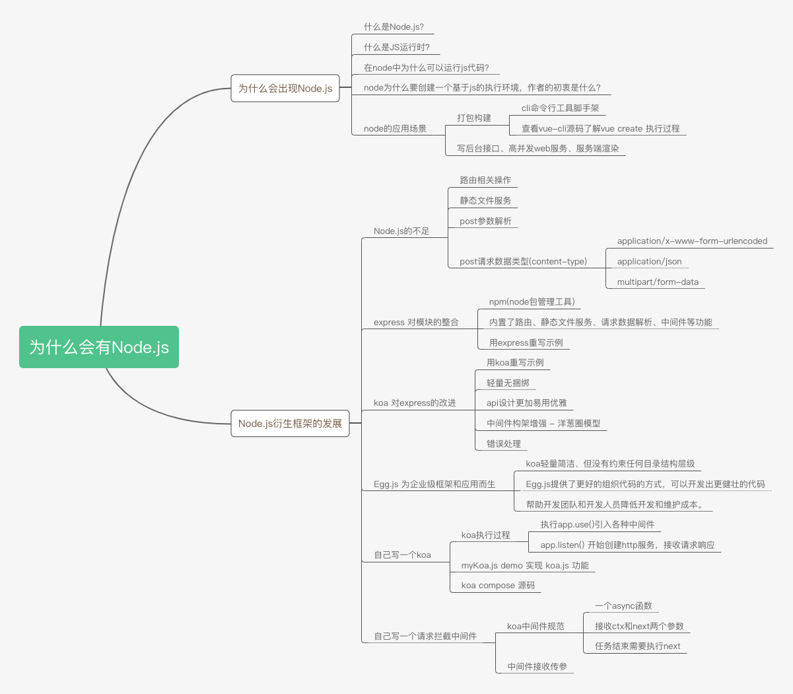
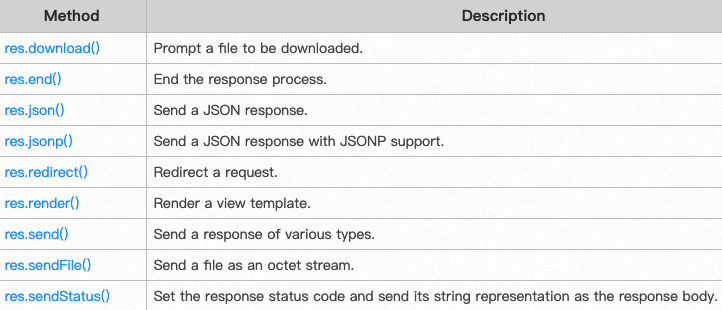
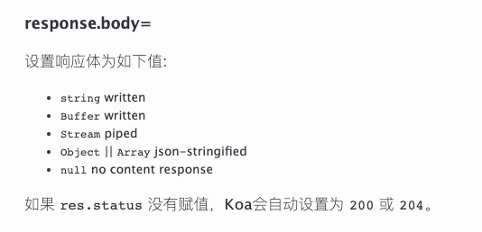
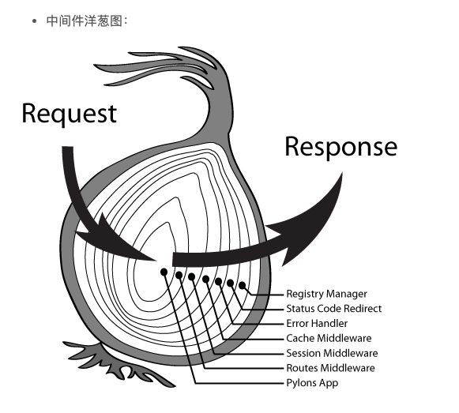

# 为什么会有Node.js，其衍生框架Express、Koa、Egg.js的演进过程



## 为什么会出现Node.js

首先，我们需要知道前端一般都是用Node.js来写测试接口，主要是因为他基于js，对于前端来讲，我们不需要另外去学习一门编程语言，很容易上手。这里我们先来了解下node的一些基础知识。

### 什么是Node.js？
官方解释：Node.js® is a JavaScript runtime built on Chrome's V8 JavaScript engine.

Node.js 是一个基于Chrome V8引擎的JavaScript运行时，我们一般把Node.js简称为node

### 什么是JS运行时？
我们可以简单的理解为运行js的环境。一般网页是在浏览器里面打开运行的，浏览器就是一个运行js的环境。而node也提供了一个运行js的环境。

### 在node中为什么可以运行js代码？
主要是因为node集成了Chrome V8引擎，也就是Chrome浏览器的JS引擎。

### node为什么要创建一个基于js的执行环境，作者的初衷是什么？
node的作者是Ryan Dahl /'raiən da:l/，他的工作是用C/C++写高性能web服务，对于高性能，异步IO、事件驱动是基本原则，但用C/C++写就太痛苦了。于是他设想使用另一种高级语言开发Web服务，评估了很多语言，发现很多语言虽然同是提供了异步IO和同步IO，但开发人员一旦使用了同步IO，他们就再也懒得写异步IO了，所以最终Ryan选择了JS。

综上，**node是为了写高性能web服务而生的**，它让js这门前端语言，也可以做后端服务器开发，Node目前的发展完全超出了作者的预料，它基本改变了前端的整个开发生态。下面我们来看看Node的一些应用场景

### node的应用场景
node除了集成Chrome V8引擎来提供js运行时外，还集成了libuv、llhttp、c-ares、OpenSSL、zlib等第三方库的功能，用来支持**创建http服务，解析请求、响应，操作(读写)文件，加密、压缩等**。

#### 打包构建、cli命令行工具脚手架
在浏览器端一般处于安全考虑，不会允许js在本地读写文件，而node作为服务端，操作文件的权限就完全放开了，于是出现了基于node的webpack、parcel、vue-cli等打包、构建、脚手架工具，使之前零碎的前端开发趋向于工程化，开发更加高效、规范。

我们以vue-cli这个命令行工具来看，node是怎么执行的
```bash
npm install -g @vue/cli # 安装vue-cli命令行工具
```
安装完成后，在terminal(终端)就有vue命令了，我之前对vue这个命令很迷惑，以为vue这个命令就是vue框架。之后才理解vue这个命令是vue-cli这个包提供的。我们来看看vue create xx 执行时的源码
```js
// https://github.com/vuejs/vue-cli/blob/dev/packages/%40vue/cli/bin/vue.js
program
  .command('create <app-name>')
  .description('create a new project powered by vue-cli-service')
  .option('-p, --preset <presetName>', 'Skip prompts and use saved or remote preset')
  .option('-d, --default', 'Skip prompts and use default preset')
  .option('-i, --inlinePreset <json>', 'Skip prompts and use inline JSON string as preset')
  .option('-m, --packageManager <command>', 'Use specified npm client when installing dependencies')
  .option('-r, --registry <url>', 'Use specified npm registry when installing dependencies (only for npm)')
  .option('-g, --git [message]', 'Force git initialization with initial commit message')
  .option('-n, --no-git', 'Skip git initialization')
  .option('-f, --force', 'Overwrite target directory if it exists')
  .option('--merge', 'Merge target directory if it exists')
  .option('-c, --clone', 'Use git clone when fetching remote preset')
  .option('-x, --proxy', 'Use specified proxy when creating project')
  .option('-b, --bare', 'Scaffold project without beginner instructions')
  .option('--skipGetStarted', 'Skip displaying "Get started" instructions')
  .action((name, cmd) => {
    const options = cleanArgs(cmd)

    if (minimist(process.argv.slice(3))._.length > 1) {
      console.log(chalk.yellow('\n Info: You provided more than one argument. The first one will be used as the app\'s name, the rest are ignored.'))
    }
    // --git makes commander to default git to true
    if (process.argv.includes('-g') || process.argv.includes('--git')) {
      options.forceGit = true
    }
    require('../lib/create')(name, options)
  })
```
../lib/create.js源码
```js
// https://github.com/vuejs/vue-cli/blob/dev/packages/%40vue/cli/lib/create.js
const fs = require('fs-extra')
const path = require('path')
const inquirer = require('inquirer')
const Creator = require('./Creator')
const { clearConsole } = require('./util/clearConsole')
const { getPromptModules } = require('./util/createTools')
const { chalk, error, stopSpinner, exit } = require('@vue/cli-shared-utils')
const validateProjectName = require('validate-npm-package-name')

async function create (projectName, options) {
  if (options.proxy) {
    process.env.HTTP_PROXY = options.proxy
  }

  const cwd = options.cwd || process.cwd()
  const inCurrent = projectName === '.'
  const name = inCurrent ? path.relative('../', cwd) : projectName
  const targetDir = path.resolve(cwd, projectName || '.')

  const result = validateProjectName(name)
  if (!result.validForNewPackages) {
    console.error(chalk.red(`Invalid project name: "${name}"`))
    result.errors && result.errors.forEach(err => {
      console.error(chalk.red.dim('Error: ' + err))
    })
    result.warnings && result.warnings.forEach(warn => {
      console.error(chalk.red.dim('Warning: ' + warn))
    })
    exit(1)
  }

  if (fs.existsSync(targetDir) && !options.merge) {
    if (options.force) {
      await fs.remove(targetDir)
    } else {
      await clearConsole()
      if (inCurrent) {
        const { ok } = await inquirer.prompt([
          {
            name: 'ok',
            type: 'confirm',
            message: `Generate project in current directory?`
          }
        ])
        if (!ok) {
          return
        }
      } else {
        const { action } = await inquirer.prompt([
          {
            name: 'action',
            type: 'list',
            message: `Target directory ${chalk.cyan(targetDir)} already exists. Pick an action:`,
            choices: [
              { name: 'Overwrite', value: 'overwrite' },
              { name: 'Merge', value: 'merge' },
              { name: 'Cancel', value: false }
            ]
          }
        ])
        if (!action) {
          return
        } else if (action === 'overwrite') {
          console.log(`\nRemoving ${chalk.cyan(targetDir)}...`)
          await fs.remove(targetDir)
        }
      }
    }
  }

  const creator = new Creator(name, targetDir, getPromptModules())
  // // https://github.com/vuejs/vue-cli/blob/dev/packages/%40vue/cli/lib/Creator.js
  await creator.create(options)
}

module.exports = (...args) => {
  return create(...args).catch(err => {
    stopSpinner(false) // do not persist
    error(err)
    if (!process.env.VUE_CLI_TEST) {
      process.exit(1)
    }
  })
}
```


#### 写后台接口、高并发web服务、服务端渲染
node可以创建一个http服务，做接口的请求与响应。在这方面衍生出来的框架有express.js、koa.js、egg.js等，我们可以用这些框架写一些测试接口、静态文件服务、web服务等。

在支持高并发、高性能web服务这块，目前阿里的使用场景是一个很好的例子，Java一般用来写变动少的基础设施或有事务要求的商业服务逻辑。而在需要快速迭代、需求变化非常快的用户侧，node用于替代过去php、jsp的使用场景。node已经经受了阿里双11的考验，技术上是可行的。

> 题外话，在node服务端开发方面，mock数据、自己写测试接口玩玩可以，但小团队或node不是非常强的技术团队尽量不要用node来写服务端接口，因为阿里能做好这块是因为国内顶尖的node方面人才基本都在阿里，经过多年实践踩坑，拥有相对完善的node基建和生态。虽然阿里开源了用于写商业化应用的egg.js，但目前很多公司并没有用node来写服务端，拥有实际node服务端开发经验的技术人员不多，贸然使用会有一定的试错成本。

## Node.js衍生框架发展
对node.js做了一个基本介绍后，我们单独拿其中的一个知识点来讨论 --- 怎么用node来写接口。

一般我们用的基于node的koa框架来写接口，为什么不直接用node呢，koa框架为什么这么流行？

我们要知道，在技术方面能够流行的一些框架，一定是解决了某些痛点问题，让开发更加简单、高效，所以才会有这么多人用它。

下面我们来追本溯源一下，看看为什么会有koa

### Node.js的不足
**如果用node本身的语法来写应用，会比较麻烦，需要自己做一些基础模块的封装**，来看几个例子
#### 路由相关操作
第一个例子: 用node写一个http服务：
- get 请求 '/' 时，返回index.html文本
- get 请求 '/users' 时返回 {a: 1}
- post请求 '/info' 时返回 {b: 1}
```js
const http = require('http')
const fs = require('fs')

const server = http.createServer((req, res)=> {
  const { url, method } = req
  console.log('url, method: ', url, method)

  if (url === '/' && method === 'GET') {
    fs.readFile('index.html', (err, data) => {
      if (err) throw err
      res.statusCode = 200
      res.setHeader('Content-Type', 'text/html')
      res.end(data)
    })
  } else if (url === '/users' && method === 'GET') {
    res.writeHead(200, {
      'Content-Type': 'application/json'
    })
    res.end(JSON.stringify({a: 1}))
  } else if (url === '/info' && method === 'post') {
    res.writeHead(200, {
      'Content-Type': 'application/json'
    })
    res.end(JSON.stringify({b: 1}))
  } else {
    res.end('404')
  }
})

server.listen(9000, () => { console.log('端口开启于9000') })
```
用node提供的api写，还要自己封装路由模块，这是一个不方便的地方。

#### 静态文件服务
第二个例子: 将 public 目录作为静态文件目录，让该目录里的文件可以通过http方式访问
```js
const http = require('http')
const fs = require('fs')

const server = http.createServer((req, res)=> {
  const { url, method } = req
  console.log('url, method: ', url, method)

  let staticPath = './public'
  if (url === '/' && method === 'GET') {
    fs.readFile(staticPath + '/index.html', (err, data) => {
      if (err) throw err
      res.statusCode = 200
      res.setHeader('Content-Type', 'text/html')
      res.end(data)
    })
  } else if (url === '/test.png' && method === 'GET') {
    fs.readFile(staticPath + url, (err, data) => {
      if (err) throw err
      res.statusCode = 200
      res.setHeader('Content-Type', 'image/png')
      res.end(data)
    })
  } else {
    res.end('404')
  }
})
server.listen(9000, () => { console.log('端口开启于9000') })
```
上面我只用两个简单的文件来示范，实际上静态文件目录下会有多个层级，多种不同的文件类型。需要处理很多逻辑，用node提供的api，你还需要写静态文件服务的逻辑，比较麻烦。

#### post参数解析
第三个例子，接收get请求和post请求的参数
get /user?a=1&b=2
post /user  {x:1, y: 2}
```js
const http = require('http')
const URL = require('url')
const querystring = require('querystring')

const server = http.createServer((req, res)=> {
  const { url, method } = req
  console.log('url, method: ', url, method) // url, method:  /user?a=1&b=2 GET

  let urlObj = URL.parse(url) // 返回一个Url对象
  console.log(urlObj)
  let path = urlObj.pathname
  if (path === '/user' && method === 'GET') {
    // 加 true 的二参后，会将 Url对象的 query 属性
    // 由字符串 'a=1&b=2' 转换为对象 { a: '1', b: '2' }
    let query =  URL.parse(url, true).query
    res.end(JSON.stringify(query))
  } else if (path === '/user' && method === 'POST') {
    var postData = ''; // 接收POST请求数据
    // POST请求数据需要监听request的data事件来获取
    console.log(req.headers)
    req.on('data', function (chunk) {
      postData += chunk;
      console.log('接收到了数据', chunk)
    });
    // 在end事件触发后,将post_data解析为真正的POST请求格式，可以用.语法来获取值
    req.on('end', function(){
      // postData = querystring.parse(post_data);
      console.log(postData)
      let contentType = req.headers['content-type']
      switch(contentType) {
        case 'application/x-www-form-urlencoded':
          postData = querystring.parse(postData)
          // Object.fromEntries(new URLSearchParams(postData))
          break
        case 'application/json':
          postData = JSON.parse(postData)
          break
        default:
          if (contentType.startsWith('multipart/form-data')) {
            postData = postData.split('\r\n')
          }
      }
      console.log(typeof postData, postData)
      res.end('end')
    });
  }
})
server.listen(9000, () => { console.log('端口开启于9000') })
```
#### post请求数据类型
content-type 请求数据类型

**1. postman Body = form-data**

**'content-type':'multipart/form-data; boundary=----WebKitFormBoundary8YBfQtM6JDVUJFFZ',**

```js
// 后台接收到的字符串数据
------WebKitFormBoundary8YBfQtM6JDVUJFFZ
Content-Disposition: form-data; name="a"

1
------WebKitFormBoundary8YBfQtM6JDVUJFFZ--
```

**2. postman Body = x-www-form-urlencoded**

**'content-type': 'application/x-www-form-urlencoded',**

```js
// 后台接收到的字符串数据
a=1
```

**3. postman Body = raw => JSON**

**'content-type': 'application/json'**

```js
// 后台接收到的字符串数据
{
        "a": 1
}
```

### express 对模块的整合
通过上面的三个例子，我们了解到想要用node的api来做开发，需要封装一些模块，并进行一定的整合。node有一个专门的包管理工具 ---- npm(Node Package Management)，任何人都可以注册npm账号、发布npm包，在项目中使用某个模块只需要npm install对应的模块，再require就可以了。

express就是其中的一个npm包，它把node中复杂的操作做了一定的封装、整合。 **内置了路由、静态文件服务、请求数据解析、中间件等功能**，相比自己用node api来写web应用，要方便很多，我们把上面的三个例子，用express来实现下

```js
const express = require('express')
const multer = require('multer'); // multipart/form-data
const app = express()
app.use(express.static('public')) // 静态服务

// 路由
app.get('/users', (req, res) => res.json({a: 1}))
app.post('/info', (req, res) => res.json({b: 1}))

// post、get参数
app.use(express.json()) // for parsing application/json
app.use(express.urlencoded({ extended: true })) // for parsing application/x-www-form-urlencoded

app.get('/user', (req, res) => res.json(req.query))
app.post('/user', (req, res) => res.json(req.body))
// 注意post请求头选择form-data会被请求头设置覆盖
app.post('/test', multer().none(), (req, res) => res.json(req.body)) 

app.use('/', (req, res) => res.send('404'))
app.listen(9000, () => console.log(`Example app listening on port 9000!`))
```

### koa 对express的改进
express已经够优秀了，为什么又演进出了koa呢？我们用koa重写上面的例子，来做一下对比
```js
const Koa = require('koa')
const Router = require('koa-router')
const multer = require('@koa/multer')
const app = new Koa()
const router = new Router()

app.use(require('koa-static')(__dirname + '/public')) // 静态服务
app.use(require('koa-bodyparser')()) // 解析

// 路由
router.get('/users', ctx => ctx.body = 'users')
router.post('/info', ctx => ctx.body = { b: 1 })

// 请求参数
router.get('/user', ctx => ctx.body = ctx.query)
router.post('/user', ctx => ctx.body = ctx.request.body)
router.post('/test', multer().none(), ctx => ctx.body = ctx.request.body) 

app.use(router.routes()).use(router.allowedMethods())

app.listen(9000, () => console.log('服务已开启，端口 9000'))
```

#### 轻量无捆绑
对比两个例子来看，看起来改动很小，细心一点你会发现koa把路由、static、post参数解析等功能都从框架内部移除了，以中间件的方式引入。以前express相对来讲是比较重的，捆绑了很多功能，koa设计的就比较轻量、灵活，按需引入，渐进式增强。像vue也是这种设计，渐进式增强，按需引入，一般框架设计都有共通之处。

#### api设计更加易用优雅
仅从上面的例子，你可能看不出来什么，因为上面的信息比较少，实际express的api还有很多，我们来看看api文档

**响应数据方面**，express响应数据有多个api：res.end()，res.json()，res.send()，res.download()，res.sendFile()



koa，砍掉无用的api，只保留 ctx.body = 根据不同的数据类型，自动处理



**回调函数参数合并：res, req 合并为 ctx（context）**

- ctx.req、ctx.res 保留node原来的req与res
- 再对原来的res和req进行优化、增强，演变为 ctx.request，ctx.response, 也就是koa自己的request和response
- aliases别名，由于ctx.request.xx 和 ctx.response.xx 比较长，所以通过定义ctx的访问器属性(get/set方法)设置了一些别名
```js
// 举两个例子
// ctx.request.query 可以简写为 ctx.query
// ctx.response.body 可以简写为 ctx.body
```

#### 中间件构架增强 - 洋葱圈模型
我们先来看看express的中间件，非异步函数，只能顺序向下传递
```js
var express = require('express')
var app = express()

var requestTime = function (req, res, next) {
  req.requestTime = Date.now()
  next()
}

app.use(requestTime)

app.get('/', function (req, res) {
  var responseText = 'Hello World!<br>'
  responseText += '<small>Requested at: ' + req.requestTime + '</small>'
  res.send(responseText)
})

app.listen(3000)
```
再来看koa的中间件，异步函数，从上到下传递后，可以再自下而上传递，实现"真正" 的中间件
```js
const Koa = require('koa');
const app = new Koa();

// x-response-time
app.use(async (ctx, next) => {
  const start = Date.now();
  await next();
  const ms = Date.now() - start;
  ctx.set('X-Response-Time', `${ms}ms`);
});

// logger
app.use(async (ctx, next) => {
  const start = Date.now();
  await next();
  const ms = Date.now() - start;
  console.log(`${ctx.method} ${ctx.url} - ${ms}`);
});

// response
app.use(async ctx => {
  ctx.body = 'Hello World';
});

app.listen(3000);
```



### Egg.js 为企业级框架和应用而生
koa轻量简洁、但没有约束任何目录结构层级，Egg.js提供了更好的组织代码的方式，可以开发出更健壮的代码。可以帮助开发团队和开发人员降低开发和维护成本。

参考：[Egg.js 自动生成框架文件结构及说明](https://eggjs.org/zh-cn/basics/structure.html)

### 自己写一个koa
koa中间件机制是：利用compose函数组合，将一组需要顺序执行的函数复合为一个函数，外层函数的参数是内层函数的返回值。

执行顺序:
1. 先引入模块，创建koa对象
2. 执行app.use()引入各种中间件，返回this，支持链式调用 app.use(m1).user(m2)
3. app.listen() 开始创建http服务，接收请求响应

```js
const http = require('http')
const context = require('./context')
const request = require('./request')
const response = require('./response')

class MyKoa {
  // app.use 调用 app.use(callback)
  constructor() {
    this.middlewares = []
  }
  use(middleware) {
    this.middlewares.push(middleware)
    return this // 支持链式调用 app.use().use()
  }

  listen(...args) {
    console.log(args)
    const server = http.createServer(async (req, res) => {
      // 需要先创建上下文
      let ctx = this.createContext(req, res)
      
      // 组合函数、koa中间件核心
      let fn = this.compose(this.middlewares) // 合并为一个执行函数
      await fn(ctx)
      
      // ctx.body设置值后，并没有响应给前端，来简单写下响应的逻辑
      // 这里简单的处理了下ctx.body 但实际要有很多处理
      let bodyType = typeof ctx.body
      let result = bodyType === 'object' ? JSON.stringify(ctx.body) : ctx.body
      // 解决中文乱码的问题
      res.writeHead(200, {'Content-Type': 'text/html; charset=utf-8'});
      res.end(result)
    })
    server.listen(...args)
  }

  createContext(req, res) {
    // 先继承一些我们写的对象
    const ctx = Object.create(context)
    ctx.request = Object.create(request)
    ctx.response = Object.create(response)

    ctx.req = ctx.request.req = req
    ctx.res = ctx.response.res = res

    return ctx
  }

  compose(middlewares) {
    return function(ctx) {
      return dispatch(0) // 先执行第一个中间件
      // 定义一个函数
      function dispatch(i) { // 递归执行函数
        let middleware = middlewares[i]
        if (!middleware) { // 递归退出条件
          return Promise.resolve()
        }
        return Promise.resolve(
          middleware(ctx, () => {  // 对应 app.use(ctx, next => { await next() })
            // dispatch(i + 1)
            return dispatch(i + 1) // 如果不执行next，无法执行下一个中间件
          })
        )
      }
    }
  }
}

module.exports = MyKoa
```
在上面的例子中，我们发现将next的函数里面 return dispatch(i + 1) 改为 dispatch(i + 1)，会导致await没有按预期等待。**await 后面的内容如果函数返回值为promise，则等待promise执行完再向下执行，如果返回值非promise，await不会等待(await下面的代码和await等待的函数会同步执行)**

koa compose源码
```js
// koa compose  https://github.com/koajs/compose/blob/master/index.js

'use strict'

/**
 * Expose compositor.
 */

module.exports = compose

/**
 * Compose `middleware` returning
 * a fully valid middleware comprised
 * of all those which are passed.
 *
 * @param {Array} middleware
 * @return {Function}
 * @api public
 */

function compose (middleware) {
  if (!Array.isArray(middleware)) throw new TypeError('Middleware stack must be an array!')
  for (const fn of middleware) {
    if (typeof fn !== 'function') throw new TypeError('Middleware must be composed of functions!')
  }

  /**
   * @param {Object} context
   * @return {Promise}
   * @api public
   */

  return function (context, next) {
    // last called middleware #
    let index = -1
    return dispatch(0)
    function dispatch (i) {
      if (i <= index) return Promise.reject(new Error('next() called multiple times'))
      index = i
      let fn = middleware[i]
      if (i === middleware.length) fn = next
      if (!fn) return Promise.resolve()
      try {
        return Promise.resolve(fn(context, dispatch.bind(null, i + 1)));
      } catch (err) {
        return Promise.reject(err)
      }
    }
  }
}
```

### 自己写一个请求拦截中间件
koa中间件规范:
1. 一个async函数
2. 接收ctx和next两个参数
3. 任务结束需要执行next

```js
const mid = async (ctx, next) => {
  // 来到中间件，洋葱圈左边
  next() // 进入其他中间件
  // 再次来到中间件，洋葱圈右边
}
```
实现一个请求拦截中间件，对于黑名单内的ip，禁止访问
```js
const Koa = require('koa')
const app = new Koa()
const intercept = require('./intercept')

// 请求拦截中间件
app.use(intercept)

app.use((ctx, next) => {
  ctx.body = 'hello'
})
app.listen(3000)
```
intercept.js实现
```js
async function intercept(ctx, next) {
  let { res, req } = ctx
  const blacklist = [
    '127.0.0.1',
    '192.168.1.2'
  ]
  const ip = getClientIp(req)

  if (blacklist.includes(ip)) {
    ctx.body = '您无权限访问'
    // 如果不执行next，就无法进入到下一个中间件
  } else {
    await next()
  }
}

// 获取当前IP
function getClientIp(req) {
  let curIp = (
    req.headers['x-forwarded-for'] ||  // 是否有反向代理 IP
    req.connection.remoteAddress || // 判断 connection 的远程 IP
    req.socket.remoteAddress || // 判断后端的 socket 的 IP
    req.connection.socket.remoteAddress 
  )
  curIp.startsWith('::ffff:') && (curIp = curIp.split('::ffff:')[1])
  console.log('当前ip是', curIp)
  return curIp
}

module.exports = intercept
```
可用性扩展
```js
// let blacklist = [
//   '127.0.0.1',
//   '192.168.1.2'
// ]
// // 请求拦截中间件
// app.use(intercept(blacklist))

function intercept(blacklist) {
  return async (ctx, next) => {
    // 获取当前IP
    function getClientIp(req) {
      let curIp = (
        req.headers['x-forwarded-for'] ||  // 是否有反向代理 IP
        req.connection.remoteAddress || // 判断 connection 的远程 IP
        req.socket.remoteAddress || // 判断后端的 socket 的 IP
        req.connection.socket.remoteAddress 
      )
      curIp.startsWith('::ffff:') && (curIp = curIp.split('::ffff:')[1])
      console.log('当前ip是', curIp)
      return curIp
    }

    let { res, req } = ctx
    const ip = getClientIp(req)
  
    if (blacklist.includes(ip)) {
      ctx.body = '您无权限访问'
      // 如果不执行next，就无法进入到下一个中间件
    } else {
      await next()
    }
  }
}

module.exports = intercept
```
